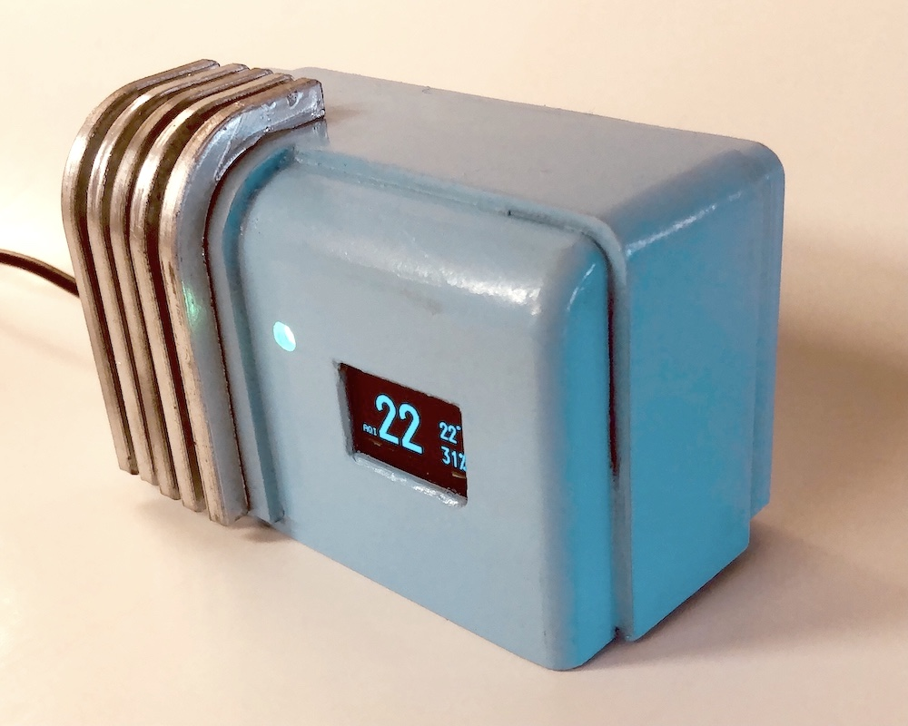
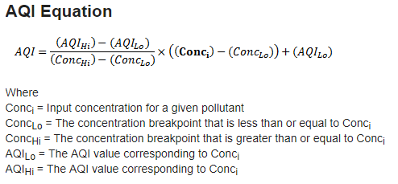
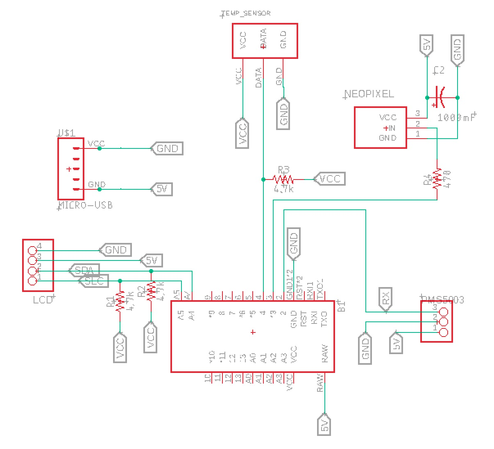
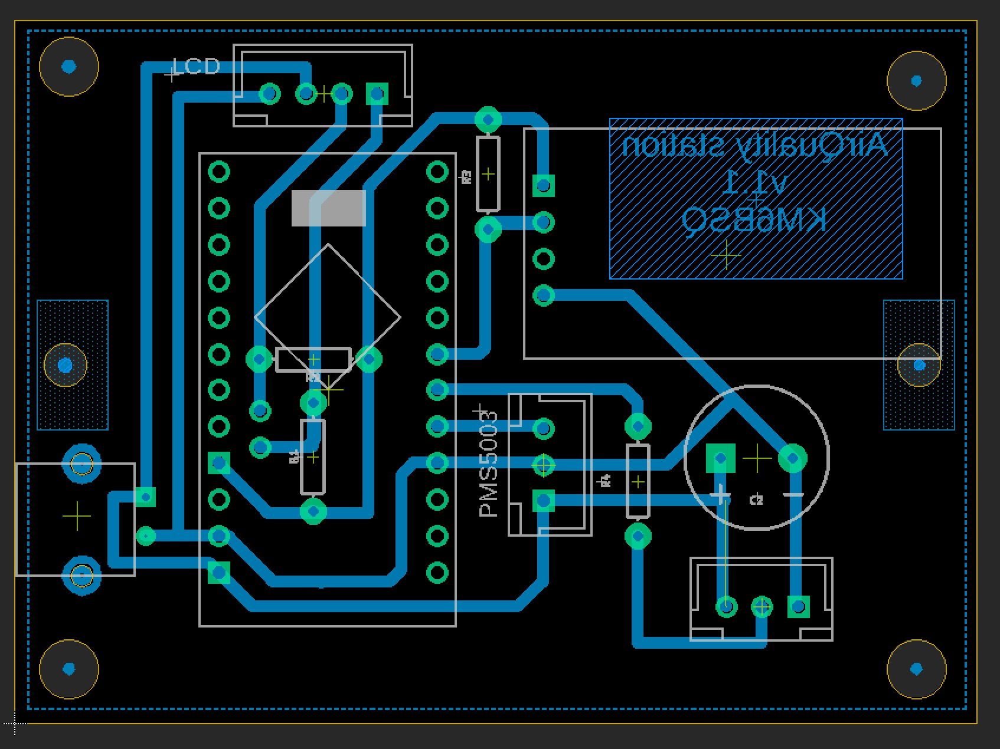

# Air quality sensor

 
 

# Documentation

[PMS5003 particulate sensor pin-out and protocol]( 
https://www.aqmd.gov/docs/default-source/aq-spec/resources-page/plantower-pms5003-manual_v2-3.pdf)
[Temperature and humidity sensor](https://www.sparkfun.com/datasheets/Sensors/Temperature/DHT22.pdf)

# AQI
## Value

## US EPA conversion
Courtesy of the United States Environmental Protection Agency Office of Research and Development, correction equation from their US wide study validated for wildfire and woodsmoke.

0-250 ug/m3 range (>250 may underestimate true PM2.5):
`PM2.5 (µg/m³) = 0.534 * <PM2.5 sensor reading, µg/m³> - 0.0844 * <humidity sensor reading, %> + 5.604`

## Colors

https://github.com/ikatkov/static_aiq_colors_calc

# Hardware
## Schematic
 
Also see "schematics" folder

## Layout
 
Also see "schematics" folder
